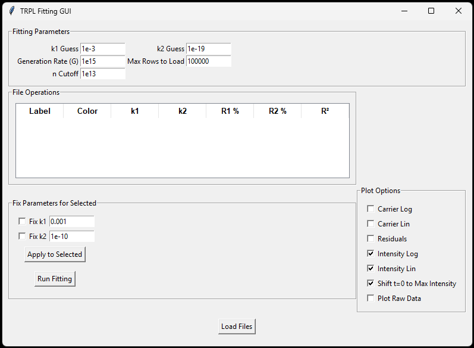

# TRPL-Analysis-GUI
GUI tool for TRPL data analysis with automated preprocessing, rate-equation fitting, and visualisation. Supports batch processing and export of fitted data and recombination metrics.

A Python-based graphical user interface for analysing time-resolved photoluminescence (TRPL) decay data, for solid-state perovskite thin films.

This tool was developed to automate the loading, preprocessing, fitting, and visualisation of TRPL datasets, reducing manual analysis time and improving reproducibility across multiple files.

## Features

- Load multiple `.txt` or `.csv` TRPL datasets
- Automatically parse numeric data from the first two columns
- Optional shift of time axis so maximum intensity is set to `t = 0`
- Normalise intensity data automatically
- Fit decay data using a bimolecular + monomolecular rate equation model
- Fix `k1` and/or `k2` during fitting on a per-file basis
- Plot:
  - carrier concentration (linear/log)
  - intensity (linear/log)
  - residuals
  - raw data
- Export:
  - shifted data
  - fitted data
  - fit summary text files

## Model

The fitting uses a rate equation of the form:

dn/dt = -k1*n - k2*n^2

where:
- `k1` represents a first-order recombination term
- `k2` represents a second-order recombination term

## Tech Stack

- Python
- NumPy
- SciPy
- Matplotlib
- Pandas
- Tkinter

